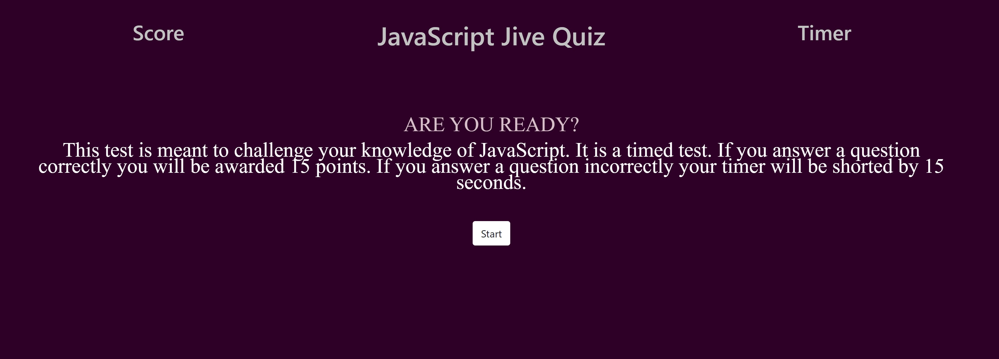

# javascript-jive-quiz

This timed test is meant to challenge your knowledge of JavaScript. The user will be awarded points for correctly answering the questions, as well as their time being penalized for incorrectly answering questions. The user in the end will have the ability to save their high score to their Local Storage.

## Quiz Abilities

* Timer
* Score
* Save score to localStorage

## Preview

The following image demonstrates the web application's default appearance and functionality:

## 📝 Live URL

* [javascript-jive-quiz](https://kcaseychamberlain.github.io/javascript-jive-quiz/)
